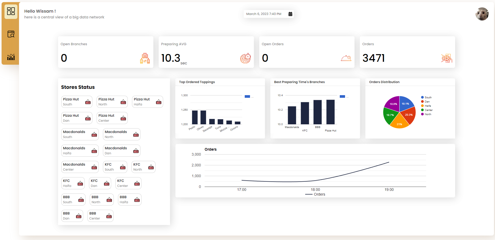
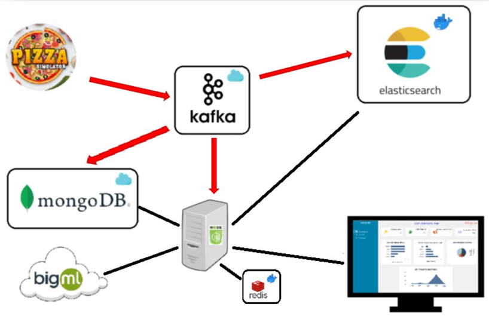
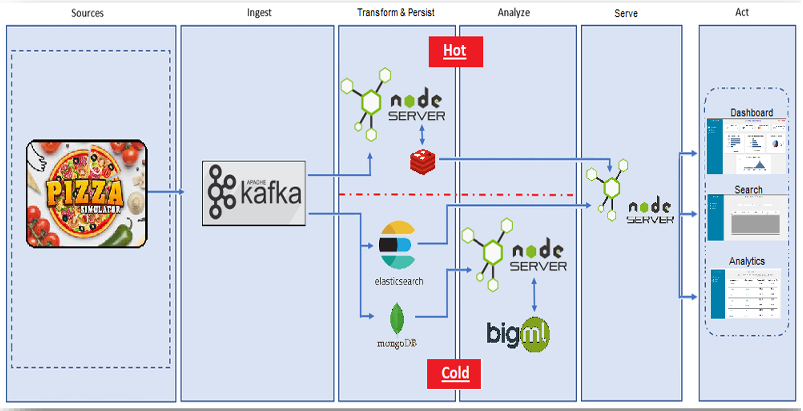
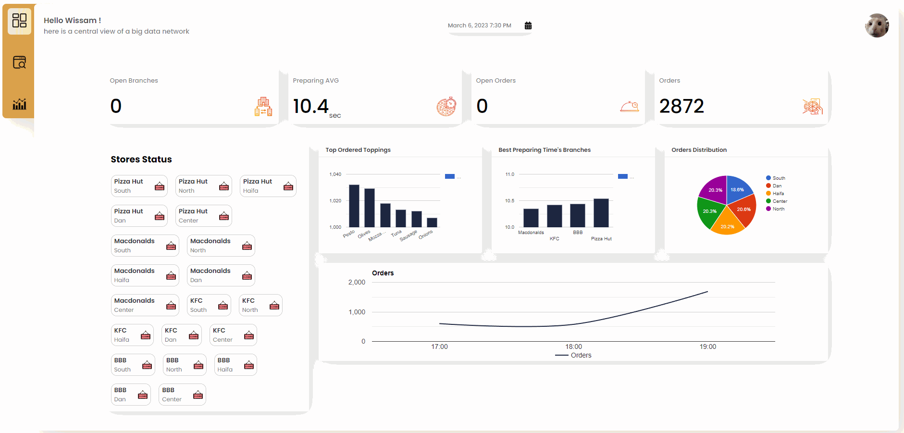
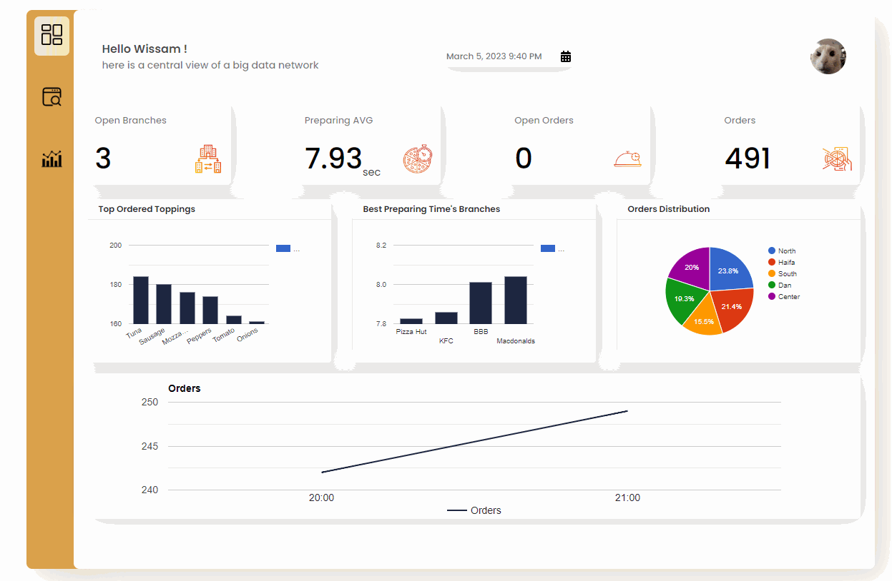

# Pizza Orders , Big Data And Microservices 

#### A part of a university project

 

## Project Overview

A microservice project that receives pizza orders from a simulator and processes them to be visulized in dashboard, analytics, and search results

 

### Infrastructure

 

### Pipeline

## How To Run

`First run this command in all folders`

    npm install

 

`Add an .env file in all folders which contains`

    STORES_TOPIC

    MONGODB_PW

    MONGODB_UR

    MONGODB_URL

 

`Run Elasticsearch in Docker `

    docker network create elastic

    docker run --name elasticsearch --net elastic -p 9200:9200 -e discovery.type=single-node -e ES_JAVA_OPTS="-Xms1g -Xmx1g" -e xpack.security.enabled=false -it 
    docker.elastic.co/elasticsearch/elasticsearch:8.2.2

 

`Run Redis in Docker `

      docker run --name some-redis -d redis -p 6379:6379

 

`Run this command in application server folder and then in data producer folder`

    npm start

 

## What has been done ?

- ### Backend

    - **Redis** for caching the dashboard data
    - **MongoDb** to store the data for training the a machine learning model
    - **Elasticsearch** for a quick search queries
    - **Kafka** for passing the data between different applications
    - **Clustering**, Evrey instance of the application server will run NUM_CPU_CORES of processes
    - Data in json format
    - Clean Architecture
    - **BigML** API for training a **machine learning model**
    - **WebSocket** for live data emitting, Socketio / Socketio Cluster / Socketio Sticky
    - Restful API
    - Express
    - Built with **Horizontal Scalling** in mind

- ### Frontend

  - React App
  - Modren Design
  - Charts
  - Dashboard page
  - Search page 
  - Analytics page for machine learning data
  - Websocket connection
  - Http requests
    

 

## Demo

`version 2`

`version 1`

 

## Authors

* **Tarik Husin**  - linkedin -> https://www.linkedin.com/in/tarik-husin-706754184/
* **Wissam Kabha**  - github -> https://github.com/Wissam111
* **Ajwan Khori**  - github -> https://github.com/AjwanKhoury

 

